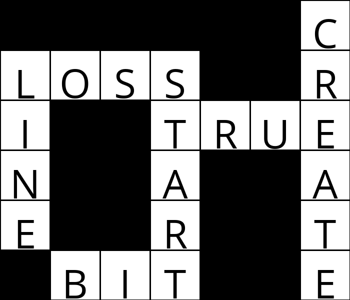

# AI Crossword Puzzle Generator

This project is an AI-based crossword puzzle generator using Python 3.12. The AI solves constraint satisfaction problems (CSP) to generate complete crossword puzzles based on a given structure and a set of words.

## How It Works

The task is to generate a crossword puzzle by selecting appropriate words from a given vocabulary and filling them into a specified crossword structure. The AI solves this problem by enforcing constraints such as word lengths, shared letter placements, and ensuring word uniqueness.

### Key Components

1. **Crossword Structure**: 
   - The crossword structure is a grid where certain squares are filled with letters, while others remain blank. The structure is defined in a text file (`structure.txt`).
   
2. **Vocabulary**: 
   - A list of words (provided in a text file `words.txt`) is used to populate the crossword puzzle.

3. **Constraint Satisfaction Problem (CSP)**:
   - The puzzle is modeled as a CSP with variables representing each sequence of squares (either across or down) that need to be filled.
   - Unary constraints ensure the selected word has the correct length.
   - Binary constraints ensure overlapping words share the same letter at intersecting squares.

## Files

- `crossword.py`: Defines the core functionality for managing the crossword puzzle structure and variables.
- `generate.py`: Contains the AI logic that solves the crossword puzzle using CSP techniques.

## Steps to Generate a Crossword Puzzle

1. **Install Requirements**:  
   Make sure you have Python 3.12 installed and install the Pillow library (for image generation) using: `pip install pillow`
2. **Run the Program**:
Generate a crossword puzzle by running the following command: `python generate.py data/structure1.txt data/words1.txt output.png`

This will create a crossword puzzle image (output.png) based on the specified structure and vocabulary.

## Functions
Inside `generate.py`

1. **`enforce_node_consistency()`**  
   Enforces node consistency by ensuring that every value (word) in the domain of a variable has the correct length for that variable.

2. **`revise(x, y)`**  
   Ensures arc consistency by checking if there is a valid word for variable `x` that doesn't conflict with any word in the domain of variable `y`.

3. **`ac3()`**  
   Enforces arc consistency across the puzzle by processing arcs between all neighboring variables.

4. **`assignment_complete()`**  
   Checks if the puzzle is complete by verifying that every variable is assigned a word.

5. **`consistent()`**  
   Checks if the current assignment is consistent, i.e., all values are of the correct length, there are no conflicts in overlaps, and all words are unique.

6. **`order_domain_values(var)`**  
   Returns a list of possible values for a variable, ordered according to the least-constraining values heuristic.

7. **`select_unassigned_variable()`**  
   Selects an unassigned variable, prioritizing variables with the fewest remaining values and most neighbors (degree heuristic).

8. **`backtrack()`**  
   Uses backtracking search to solve the puzzle by trying different assignments and inferring potential solutions with constraints.

## Example Output
When you run the program, an example of the output is the following: `python generate.py data/structure1.txt data/words1.txt output.png`

The program will output a crossword puzzle saved as output.png.

## Conclusion
This project demonstrates how to use AI techniques like **constraint satisfaction**, **backtracking**, and **arc consistency** to generate crossword puzzles.
# AI-Crossword-Puzzle-Generator
# AI-Crossword-Puzzle-Generator
